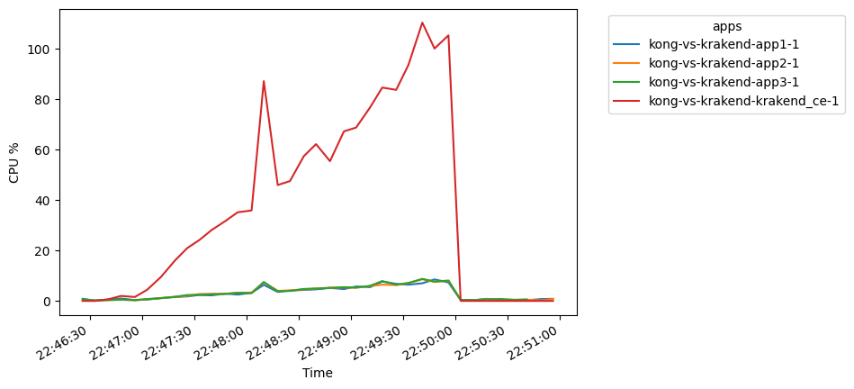

# Kong API Gateway vs Krakend

This project is an effort to analize two powerfull API Gateways. There is still much more to analize, but this initial report can give us a hint for decision

This project is based on the runner up of the "Rinha de backend" competition. You can find his project [here](https://github.com/leorcvargas/rinha-go)

⚠️This research is dated to february 2024. Also, any code at this repository is not meant to be used directly in production. This repository attends to a particular need and may not be suitable as source for any arbitrary decision. 

# Solutions comparison

## Feature comparison
| Feature                  | KrakenD                    | Kong Gateway                |
|--------------------------|----------------------------|-----------------------------|
| **Type**                 | API Gateway                | API Gateway                 |
| **Performance**          | High performance, designed for lightweight and fast processing | High performance, scalable, with a focus on efficiency |
| **Scalability**          | Highly scalable, stateless design ideal for containerized environments | Highly scalable, supports clustering and can be deployed on multiple nodes |
| **Security Features**    | Supports OAuth2, JWT, API keys, and rate limiting | Extensive security features including OAuth2, JWT, ACLs, bot detection, and more |
| **Extensibility**        | Limited built-in plugins, focus on being lightweight; custom middleware can be developed | Rich ecosystem of plugins for authentication, monitoring, transformations, and more; custom plugin development supported |
| **Ease of Use**          | Simplified configuration via a single JSON file, less steep learning curve | Comprehensive documentation, more complex setup due to extensive features |
| **Community and Support**| Growing community, open source with commercial support options | Large and active community, open source with enterprise support options |
| **Cost-Effectiveness**   | Free and open source, commercial support available | Open source and free version available; enterprise version for advanced features and support |
| **Deployment**           | Docker, Kubernetes, and most cloud providers | Docker, Kubernetes, various cloud providers, and on-premise options |
| **API Design and Mocking** | Not a core feature, focuses on API Gateway functionality | Offers API design, testing, and mocking tools with Kong Studio (for enterprise) |
| **Monitoring and Analytics** | Basic monitoring capabilities; integration with external tools required for advanced analytics | Advanced analytics and monitoring through plugins and enterprise features |
| **Configuration Management** | Declarative configuration via JSON | Declarative and dynamic configuration, with Admin API for management |

## Free tier
| Feature                        | KrakenD (Open Source)              | Kong Gateway (Free Version)        |
|--------------------------------|------------------------------------|------------------------------------|
| **Core API Gateway Features**  | Full access to API Gateway functionality, including routing, aggregation, and rate limiting | Basic API Gateway functionalities, including routing, load balancing, and logging |
| **Performance and Scalability**| High performance and scalability with stateless design | High performance, with limitations on scalability compared to the enterprise version |
| **Security Features**          | Basic security features like JWT, OAuth2 support | Basic security features; advanced features like OIDC might require plugins or enterprise edition |
| **Extensibility and Plugins**  | Limited to the built-in functionalities; custom development required for additional features | Access to a set of free plugins for extensibility; some advanced plugins are reserved for the enterprise edition |
| **Support and Updates**        | Community support; no guaranteed response times | Community support; additional support available through enterprise plans |
| **Monitoring and Analytics**   | Basic monitoring capabilities; integration with external monitoring tools required | Basic monitoring capabilities; advanced analytics and monitoring available in the enterprise edition |
| **Deployment Options**         | Docker, Kubernetes, and cloud providers | Docker, Kubernetes, and cloud providers; some advanced deployment features might be enterprise-only |
| **Rate Limiting**              | Included | Included, with advanced configurations available in the enterprise edition |
| **Logging and Observability**  | Basic logging features; external tools required for advanced observability | Basic logging features; enhanced observability features in the enterprise edition |
| **Configuration Management**   | Declarative configuration via JSON | Declarative configuration; dynamic configuration with Admin API |
| **Documentation and Community**| Comprehensive documentation and open community support | Comprehensive documentation and open community support; additional resources for enterprise customers |

## Paid 
| Criteria                      | KrakenD Enterprise Edition                | Kong Gateway Enterprise Edition        |
|-------------------------------|-------------------------------------------|----------------------------------------|
| **Base Price**                | Contact for quote                         | Contact for quote                      |
| **Pricing Model**             | Typically based on the number of servers, API requests, or a subscription model | Often based on the number of API calls, instances, or a subscription model |
| **Included Features**         | Advanced analytics, High availability, Premium support, Custom plugins | Advanced security features, High availability, Premium support, Developer portal |
| **Support Level**             | 24/7 support, Dedicated account manager (depends on the plan) | 24/7 support, Dedicated account manager (depends on the plan) |
| **SLA Availability**          | Yes (depends on the contract)             | Yes (depends on the contract)          |
| **Customization and Consulting** | Available upon request                   | Available upon request                  |
| **Training and Onboarding**   | Customized training sessions and onboarding (varies by package) | Customized training and onboarding services (varies by package) |
| **Minimum Commitment**        | Not publicly specified; can vary based on negotiation | Not publicly specified; often requires annual commitment |
| **Additional Costs**          | Possible additional costs for extra services, features, or higher tiers of support | Possible additional costs for additional features, API calls beyond plan limits, or premium plugins |

# Benchmark

## Krakend

### Response time percentiles over time (OK)

### Overall resourres usage

### CPU usage over time

### RAM usage over time

### RAM percentage usage over time

## Kong

### Response time percentiles over time (OK)

### Overall resourres usage

### CPU usage over time

### RAM usage over time

### RAM percentage usage over time

